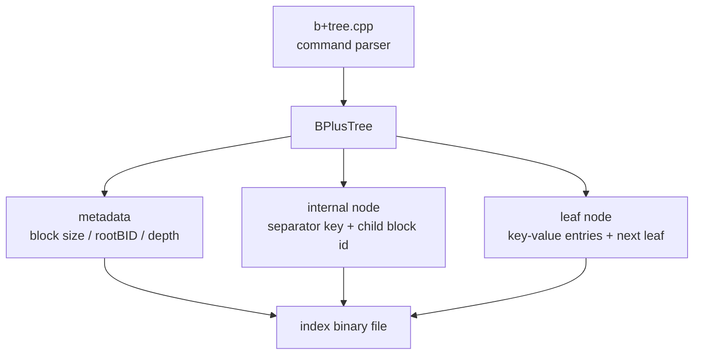
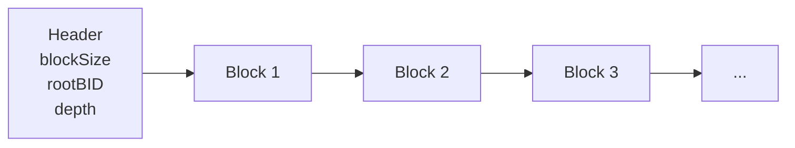
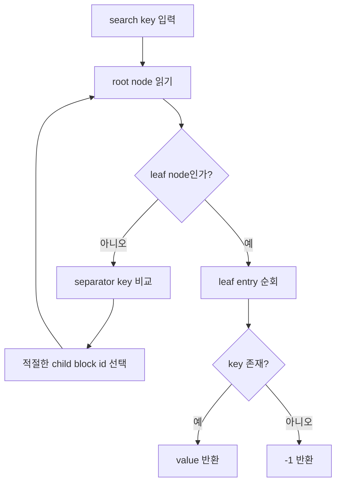
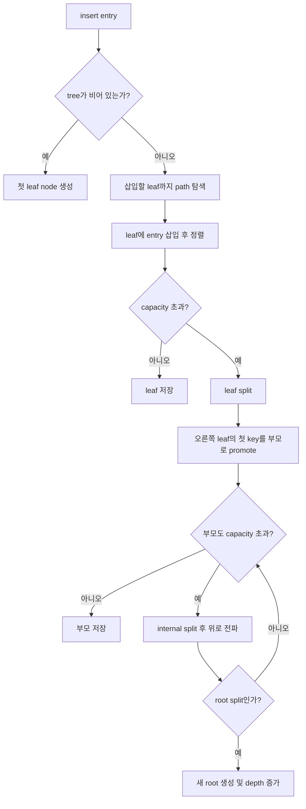
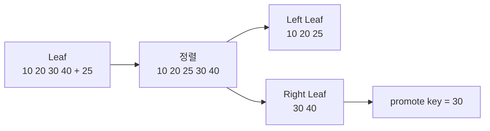
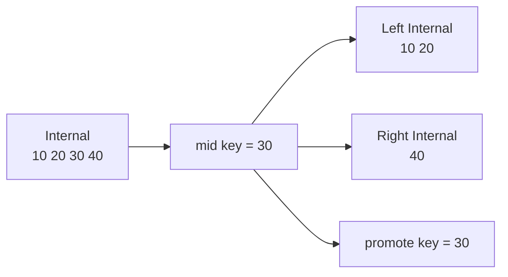
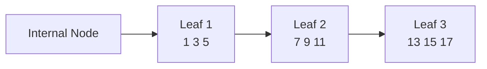

# B+ Tree Index File

## 1. 프로젝트 개요

이 프로젝트는 파일 기반 B+ Tree index를 구현한 프로그램이다.  
명령행 인자를 통해 index 파일을 생성하고, key-value 데이터를 삽입하며, 단일 key 탐색과 범위 탐색을 수행한다.

구현은 크게 두 부분으로 나뉜다.

- `b+tree.cpp`: 명령행 인자 처리, 입력 파일 읽기, 출력 파일 쓰기
- `BPlusTree.cpp`: B+ Tree의 삽입, 탐색, range search, node split, 파일 입출력 구현

지원하는 명령은 다음과 같다.

| 명령 | 기능 |
| --- | --- |
| `c` | index 파일 생성 |
| `i` | key-value 데이터 삽입 |
| `s` | 단일 key 탐색 |
| `r` | 범위 탐색 |
| `p` | tree 구조 출력 |

## 2. B+ Tree 동작 원리

B+ Tree는 데이터베이스와 파일 시스템에서 많이 사용되는 balanced tree 기반 index 구조이다.  
일반적인 binary search tree와 달리 하나의 node가 여러 개의 key와 child pointer를 가질 수 있으며, 모든 실제 데이터는 leaf node에 저장된다.

이 프로젝트의 B+ Tree는 다음 특징을 가진다.

- internal node는 탐색 경로를 결정하는 separator key와 child block id를 저장한다.
- leaf node는 실제 `key-value` entry를 저장한다.
- leaf node는 다음 leaf node의 block id를 저장하여 range search를 빠르게 수행한다.
- root block id와 tree depth는 index file의 header 영역에 저장된다.
- 각 node는 고정 크기 block으로 file에 저장된다.

## 3. 전체 구조



## 4. 파일 저장 방식

index 파일의 앞부분에는 metadata가 저장되고, 그 뒤에는 고정 크기 block들이 순서대로 저장된다.



block id는 다음 식을 통해 실제 파일 offset으로 변환된다.

```cpp
std::streamoff BPlusTree::blockOffset(int blockId) const {
    return HEADER_SIZE + static_cast<std::streamoff>(blockId - 1) * blockSize_;
}
```

metadata를 읽을 때는 block size, root block id, depth를 읽고, block size를 바탕으로 node 하나에 저장 가능한 entry 개수를 계산한다.

```cpp
void BPlusTree::getMetadata(const char *fileName) {
    binFile_.open(fileName, std::ios::binary | std::ios::out | std::ios::in);

    blockSize_ = readInt();
    rootBID_ = readInt();
    depth_ = readInt();

    capacity_ = (blockSize_ - UNIT) / (2 * UNIT);
}
```

## 5. 탐색 과정

탐색은 root node에서 시작하여 leaf node까지 내려가는 방식으로 수행된다.

1. 현재 node가 internal node이면 separator key를 비교한다.
2. 찾는 key보다 큰 separator를 만나기 전까지 오른쪽 child로 이동한다.
3. leaf node에 도착하면 leaf 내부 entry를 순회하며 key를 찾는다.



핵심 탐색 경로 계산 코드는 다음과 같다.

```cpp
Path BPlusTree::getPath(int key) {
    Path path;
    int current = rootBID_;

    for (int level = 0; level <= depth_; ++level) {
        path.nodes.emplace_back(current);
        if (level == depth_) {
            break;
        }

        const InternalNode node = readInternal(current);
        current = node.firstChild;
        for (const Entry &separator: node.separators) {
            if (separator.key > key) {
                break;
            }
            current = separator.value;
        }
    }

    path.dest = current;
    return path;
}
```

## 6. 삽입 과정

B+ Tree의 삽입은 단순히 leaf에 entry를 추가하는 것에서 끝나지 않는다.  
node가 가득 찬 경우 split이 발생하고, split 결과로 생긴 separator key가 부모 node로 전파된다.



전체 삽입 흐름은 다음 코드에서 확인할 수 있다.

```cpp
void BPlusTree::insert(Entry entry) {
    if (numOfNodes_ == 0) {
        insertEmpty(entry);
    } else if (numOfNodes_ == 1) {
        insertIntoOnlyOne(entry);
    } else {
        const Path path = getPath(entry.key);
        Entry promoted = insertLeaf(entry, path.nodes.back());

        for (size_t i = path.nodes.size() - 1; i > 0 && !isNoSplit(promoted); --i) {
            promoted = propagate(promoted, path.nodes[i - 1]);
        }
    }

    writeMetadata();
}
```

## 7. Leaf Node Split

leaf node가 가득 찬 상태에서 새 entry가 들어오면 다음 순서로 처리한다.

1. 새 entry를 leaf에 추가한다.
2. key 기준으로 정렬한다.
3. 중간 지점을 기준으로 왼쪽 leaf와 오른쪽 leaf로 나눈다.
4. 기존 leaf는 왼쪽 데이터를 저장한다.
5. 새 block에는 오른쪽 데이터를 저장한다.
6. 오른쪽 leaf의 첫 번째 key를 부모 node로 올린다.



구현 코드는 다음과 같다.

```cpp
Entry BPlusTree::insertLeaf(Entry entry, int blockId) {
    LeafNode leaf = readLeaf(blockId);
    leaf.entries.emplace_back(entry);
    sortEntries(leaf.entries);

    if (static_cast<int>(leaf.entries.size()) <= capacity_) {
        writeLeaf(blockId, leaf.entries, leaf.next);
        return NO_SPLIT;
    }

    const int mid = splitIndex();
    const std::vector<Entry> left(leaf.entries.begin(), leaf.entries.begin() + mid);
    const std::vector<Entry> right(leaf.entries.begin() + mid, leaf.entries.end());
    const int newBlockId = ++numOfNodes_;

    writeLeaf(blockId, left, newBlockId);
    writeLeaf(newBlockId, right, leaf.next);

    return {right.front().key, newBlockId};
}
```

## 8. Internal Node Split

internal node split은 leaf split과 다르다.  
leaf split에서는 오른쪽 leaf의 첫 key를 부모로 복사하지만, internal split에서는 중간 separator key가 부모로 올라가고 기존 internal node에서는 제거된다.



구현 코드는 다음과 같다.

```cpp
Entry BPlusTree::propagate(Entry entry, int blockId) {
    InternalNode node = readInternal(blockId);
    node.separators.emplace_back(entry);
    sortEntries(node.separators);

    if (static_cast<int>(node.separators.size()) <= capacity_) {
        writeInternal(blockId, node.firstChild, node.separators);
        return NO_SPLIT;
    }

    const int mid = splitIndex();
    const std::vector<Entry> left(node.separators.begin(), node.separators.begin() + mid);
    const std::vector<Entry> right(node.separators.begin() + mid + 1, node.separators.end());

    const int promotedKey = node.separators[mid].key;
    const int rightFirstChild = node.separators[mid].value;
    const int newBlockId = ++numOfNodes_;

    writeInternal(blockId, node.firstChild, left);
    writeInternal(newBlockId, rightFirstChild, right);

    if (blockId == rootBID_) {
        const int newRootId = ++numOfNodes_;
        writeInternal(newRootId, blockId, {{promotedKey, newBlockId}});

        rootBID_ = newRootId;
        ++depth_;
        return NO_SPLIT;
    }

    return {promotedKey, newBlockId};
}
```

## 9. Range Search

B+ Tree에서 범위 탐색은 매우 효율적이다.  
먼저 시작 key가 들어갈 leaf node를 찾은 뒤, leaf node의 `next` 값을 따라가면서 범위 안에 있는 entry만 순서대로 읽으면 된다.



이 프로젝트에서는 다음과 같이 구현했다.

```cpp
std::vector<Entry> BPlusTree::rangeSearch(int first, int last) {
    std::vector<Entry> entries;

    int leafId = getPath(first).dest;
    while (leafId != 0) {
        const LeafNode leaf = readLeaf(leafId);
        for (const Entry &entry: leaf.entries) {
            if (entry.key > last) {
                return entries;
            }
            if (entry.key >= first) {
                entries.emplace_back(entry);
            }
        }
        leafId = leaf.next;
    }

    return entries;
}
```

## 10. 구현 후기

과제 초반에는 B+ Tree 자체가 막막하게 느껴져서, 먼저 파일 입출력을 제외하고 메모리 상에서 삽입과 탐색이 동작하는 구조를 구현하는 것부터 시작했습니다. 특히 insertion 과정에서 단순히 정렬된 위치에 key-value를 넣는 것뿐만 아니라, 노드가 가득 찼을 때 leaf node와 internal node를 각각 다른 방식으로 split해야 한다는 점을 이해하는 데 시간이 걸렸습니다. 이후 강의 시간에 다룬 의사코드를 참고하면서, leaf split에서는 오른쪽 노드의 첫 번째 key를 부모로 올리고, internal split에서는 중간 separator key를 부모로 올리는 방식으로 구현할 수 있었습니다.

파일 입출력을 구현한 뒤에는 난이도가 훨씬 높아졌습니다. 메모리에서는 포인터나 객체 참조로 쉽게 노드를 연결할 수 있지만, 파일 기반 구현에서는 각 노드를 block id로 관리하고, block id를 실제 파일 offset으로 변환해야 했기 때문입니다. 이 프로젝트에서는 header 뒤에 고정 크기 block들이 저장되도록 설계하였고, metadata를 통해 root block id와 depth를 유지했습니다.

삽입 기능에서는 현재 tree 상태에 따라 경우를 나누었습니다. 아무 노드도 없는 경우에는 첫 leaf node를 root로 만들고, root 하나만 있는 경우에는 root leaf가 split되면 새로운 root internal node를 생성했습니다. 이후부터는 삽입 대상 leaf까지 경로를 찾고, split이 발생하면 부모 노드로 separator를 전파하는 방식으로 구현했습니다.

가장 핵심이 되는 부분은 leaf node split이었습니다. leaf에 새 entry를 넣고 정렬한 뒤 capacity를 초과하면, 왼쪽과 오른쪽 leaf로 나누고 오른쪽 leaf의 첫 번째 key를 부모로 올립니다. leaf node끼리는 range search를 위해 `next` pointer도 유지했습니다.

internal node split은 leaf split보다 더 헷갈렸습니다. leaf에서는 오른쪽 첫 key가 부모에 복사되는 느낌이라면, internal node에서는 중간 key가 부모로 올라가고 기존 노드에서는 제거됩니다. 이 차이를 정확히 구분하는 것이 중요했습니다.

디버깅 과정에서도 어려움이 있었습니다. 파일 기반으로 저장하다 보니 메모리 구조를 바로 확인하기 어렵고, 잘못된 block offset이나 잘못된 root metadata가 저장되면 이후 탐색 전체가 틀어질 수 있었습니다. 그래서 표준 출력으로 중간 값을 확인하거나, tree 출력 기능을 통해 root와 하위 level의 key 상태를 확인하면서 문제를 해결했습니다.

이번 과제를 통해 B+ Tree의 삽입, split, 부모 노드 전파, root 변경, leaf node 연결 구조를 훨씬 명확하게 이해할 수 있었습니다. 특히 파일 기반으로 구현하면서 단순 자료구조 구현을 넘어, block 단위 저장 방식과 metadata 관리의 중요성을 체감했습니다. 다만 현재 구현에서는 삽입 시 entry를 추가한 뒤 전체를 정렬하는 방식이므로, insert나 search 과정에서 더 효율적으로 위치를 찾는 방식으로 개선할 여지가 있다고 느꼈습니다. 그럼에도 전체적으로 B+ Tree가 데이터베이스 index에서 왜 사용되는지, 그리고 range search에 왜 적합한지 직접 구현을 통해 이해할 수 있었던 의미 있는 과제였습니다.
